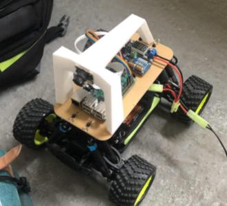

## Torte Rapide Training

This repo is Tortue Rapide training center! It provides model and tools for training self driving model cars for (Ironcar race)[https://twitter.com/ironcarfrance].

The main goal of these functions is to provide trained models as hdf5 files for car driving. Relying on Keras for training and DonkeyCar for car management and data acquisition. Training is done on google collaboratory, and prediction on the pi. Car management part of the project is handled by https://github.com/augustin-barillec/tortue-rapide

The repo include class fit models with batch data augmentations on memory or on disk, 3D image generator class to feed 3D convolutions, model explanation using Lime and Keras, and data management utils.

Wining solution of several races in 2019. 

maintainer: raphael.carmona-hagelsteen@ysance.com

