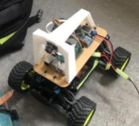

## Tortue Rapide Training

This repo is Tortue Rapide training center! It provides model and tools for training self driving model cars for [Ironcar race](https://twitter.com/ironcarfrance).

The main goal of these functions is to provide trained models as hdf5 files for car driving. Relying on Keras for computer vision and DonkeyCar for car management. Training require a gpu (we use google collaboratory), prediction occur on the pi. Car management and data acquisition side of the project is handled by https://github.com/augustin-barillec/tortue-rapide

Utils include batch generators to fit models with on the fly data augmentations both on memory or on disk using albumentation, 3D image generators to feed 3D convolutions, model explanation using Lime and Keras, and data management utils.

Winning solution for several races in 2019 !

raphael.carmona-hagelsteen@ysance.com

